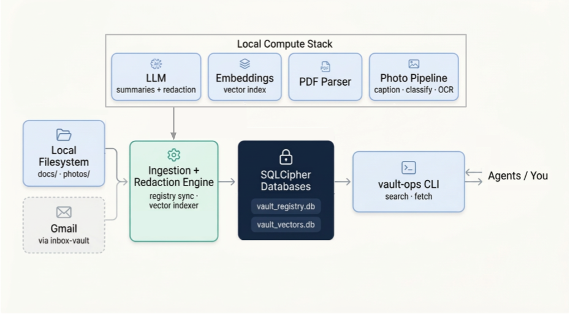

# llm-vault

Privacy-first local vault for personal documents, photos, and mail-derived metadata.

`llm-vault` builds an encrypted local registry and vector index over local content, then exposes:

- `vault-ops` for operator workflows such as indexing, repair, upgrade, and maintenance
- `vault-agent` for constrained agent-safe status and redacted search
- a repo-local OpenClaw plugin package that wraps only the `vault-agent` safe surface



## Overview

Use this repo when you want local retrieval over private content without handing raw data to a hosted SaaS toolchain. `llm-vault` expects your model and parsing stack to stay local: local OpenAI-compatible endpoints for summaries, embeddings, and redaction, plus optional local services for photo analysis and scanned-PDF parsing.

This repo is installable from a checkout with `pip install -e .[dev]`. The OpenClaw integration in this repo is a repo-local plugin package, not a published standalone plugin release.

## Safety Boundary

| Surface | Intended user | Scope | Must not do |
| --- | --- | --- | --- |
| `vault-ops` | operator | `status`, `update`, `repair`, `upgrade`, unrestricted maintenance | agent-safe execution, redacted-only guarantees |
| `vault-agent` | local agent | `status`, `search-redacted` | indexing, repair, upgrade, clearance/config override |
| `plugins/llm-vault-openclaw` | OpenClaw | `/vault ...` command wrapper plus explicit agent tools | call `vault-ops`, expose unredacted search |

`vault-ops` remains operator-only. The OpenClaw plugin shells only into `vault-agent`, and every search path stays backed by `vault-agent search-redacted`.

## Local Install

```bash
git clone https://github.com/sveinnpalsson/llm-vault.git
cd llm-vault
python3.11 -m venv .venv
source .venv/bin/activate
python -m pip install --upgrade pip
python -m pip install -e .[dev]
cp vault-ops.toml.example vault-ops.toml
mkdir -p state
export LLM_VAULT_DB_PASSWORD='choose-a-strong-passphrase'
vault-ops update --max 300
vault-ops status
```

`pip install -e .` exposes installable `vault-ops` and `vault-agent` entry points from the checkout. The repo-root `./vault-ops` and `./vault-agent` wrappers remain compatibility shims.

## Required Inputs

Required for a real setup:

- `LLM_VAULT_DB_PASSWORD`
- at least one docs root or photos root in `vault-ops.toml`
- a local embedding endpoint
- a local redaction path

Usually required for a useful setup:

- a local summary endpoint
- `pdftotext` for native-text PDFs

Optional:

- a local photo-analysis service (enabled only when URL is explicitly configured)
- a local PDF parse service for scanned PDFs (enabled only when URL is explicitly configured)
- a read-only `inbox-vault` bridge for mail

## Minimal `vault-ops.toml`

Start from [`vault-ops.toml.example`](vault-ops.toml.example) and point it at the local services you actually run:

```toml
[paths]
registry_db = "state/vault_registry.db"
vectors_db = "state/vault_vectors.db"
docs_roots = ["/absolute/path/to/docs"]
photos_roots = []

[summary]
base_url = "http://127.0.0.1:8080/v1"
model = "qwen3-14b"

[embedding]
base_url = "http://127.0.0.1:8080/v1"
model = "Qwen3-Embedding-8B"

[redaction]
base_url = "http://127.0.0.1:8080/v1"
model = "qwen3-14b"

[search]
top_k = 5
search_level = "auto"
```

Before the first real run:

- add at least one `docs_roots` or `photos_roots` entry
- point `[summary]`, `[embedding]`, `[redaction]`, and any optional `[photo_analysis]` / `[pdf]` sections at reachable local endpoints
- note: `[photo_analysis]` and `[pdf]` are disabled by default when URL fields are absent/commented-out; set `url` / `parse_url` (or `VAULT_PHOTO_ANALYSIS_URL` / `VAULT_PDF_PARSE_URL`) to enable
- create `state/` if it does not exist yet
- export `LLM_VAULT_DB_PASSWORD`
- run `vault-ops status` and fix any wiring warnings before long ingest runs

The first `vault-ops update` initializes the encrypted registry/vector state for this checkout. A bounded first pass can leave the system usable but degraded until the remaining corpus is indexed.

## Minimal Validation

```bash
vault-ops update --max 300
vault-ops status --json
vault-ops search "tax receipt" --json
vault-agent status
vault-agent search-redacted "tax receipt" --source docs --top-k 3
```

If mail is enabled:

```bash
vault-ops update --source mail
vault-ops search "budget approval" --source mail --json
```

## OpenClaw Integration

The repo-local plugin package lives at [`plugins/llm-vault-openclaw`](plugins/llm-vault-openclaw).

OpenClaw has two separate surfaces here:

- command surface: `/vault status`, `/vault search ...`, `/vault search-redacted ...`
- tool surface: `llm_vault_status`, `llm_vault_search`

The tool surface is the intended autonomous path. `llm_vault_search` remains redacted-only and safe by default for now. The slash command stays available for manual use.

### `openclaw.json`

Repo-local plugin discovery belongs under `plugins.load.paths`. Plugin runtime config belongs under `plugins.entries.llm-vault.config`.

```json
{
  "plugins": {
    "load": {
      "paths": [
        "/absolute/path/to/llm-vault/plugins/llm-vault-openclaw"
      ]
    },
    "allow": [
      "llm-vault"
    ],
    "entries": {
      "llm-vault": {
        "enabled": true,
        "config": {
          "repoRoot": "/absolute/path/to/llm-vault",
          "vaultAgentPath": "/absolute/path/to/llm-vault/vault-agent",
          "timeoutSeconds": 120
        }
      }
    }
  }
}
```

If your OpenClaw install already scans a plugin directory, you can copy `plugins/llm-vault-openclaw/` there intact and omit `plugins.load.paths`. The plugin config still belongs under `plugins.entries.llm-vault.config`.

### Agent Allowlist

No extra agent block is needed if the target agent already has open tool access. If the agent uses a tool allowlist, add the llm-vault tools explicitly:

```json
{
  "agents": {
    "list": [
      {
        "id": "my-agent",
        "tools": {
          "alsoAllow": [
            "llm_vault_status",
            "llm_vault_search"
          ]
        }
      }
    ]
  }
}
```

If the agent already uses `tools.allow`, add the same tool names there instead of `alsoAllow`.

## Docs

- [OpenClaw agent setup flow](docs/openclaw-agent-setup.md)
- [OpenClaw plugin contract](docs/openclaw-plugin.md)
- [Manual OpenClaw validation checklist](docs/manual-openclaw-agent-validation.md)
- [Infrastructure stack and config shape](docs/infrastructure-stack.md)
- [Unified local skill](skills/vault-unified-local)

## Status

This repo contains a working repo-local OpenClaw plugin path with command and tool surfaces backed only by `vault-agent`. It is not yet a published standalone plugin release, and fresh-agent validation remains manual and operator-run.

## Validation

```bash
ruff check scripts tests
pytest -q
```

Optional bounded live smoke tests remain opt-in through `LLM_VAULT_RUN_LIVE_SMOKE=1`.
