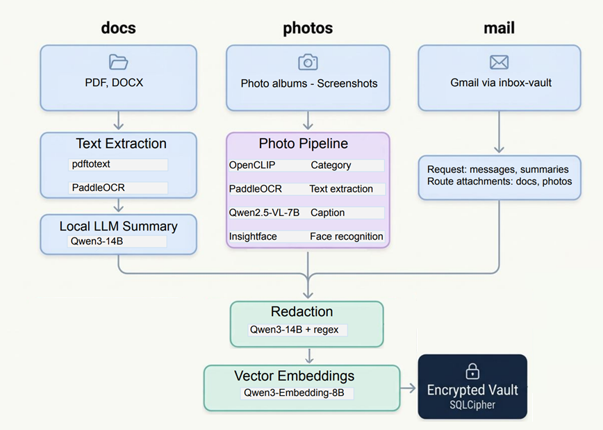

# llm-vault

[](https://github.com/sveinnpalsson/llm-vault/actions)

[](LICENSE)

Privacy-first local vault for personal documents, photos, and mail.

`llm-vault` builds an encrypted local registry and vector index over local content, then exposes:

- `vault-ops` for operator workflows such as indexing, repair, upgrade, and maintenance
- `vault-agent` for constrained agent-safe status and redacted search
- a repo-local OpenClaw plugin package that wraps only the `vault-agent` safe surface


## Overview

Use this repo when you want local retrieval over private content without handing raw documents, photos, or mail-derived data to a hosted SaaS toolchain. `llm-vault` is built for a local setup: your storage stays encrypted on your machine, and your retrieval pipeline runs against services you control.

This repo is installable from a checkout with `pip install -e .[dev]`. That editable install exposes `vault-ops`, `vault-agent`, and `redaction-eval`. The OpenClaw integration in this repo is a repo-local plugin package, not a published standalone plugin release.

## Recommended Local Stack

The diagram below shows the kind of local stack this project is designed for. If you want the deeper implementation notes, model choices, and service layout, see [Infrastructure stack](docs/infrastructure-stack.md).



A public-facing redaction results page lives under [`eval/redaction/`](eval/redaction/README.md). It summarizes what the current redaction engine catches, what it still misses, and how to rerun the benchmark.

## Safety Boundary

`llm-vault` has two interfaces:

- `vault-ops` is the operator interface. Use it for indexing, repair, upgrade, maintenance, and other unrestricted admin work.
- `vault-agent` is the safe agent interface. Use it for status checks and redacted search only.

The OpenClaw plugin is just the OpenClaw wrapper around `vault-agent`.
It exists so agents inside OpenClaw can use the same redacted-only retrieval surface without being given direct `vault-ops` access.

That means the boundary is:

- `vault-ops` is operator-only
- `vault-agent` is the safe redacted interface
- the OpenClaw plugin only exposes that same `vault-agent` surface inside OpenClaw

So an autonomous agent should use `vault-agent` or the OpenClaw plugin tools, and should not be given direct `vault-ops` access.

## Local Install

```bash
git clone https://github.com/sveinnpalsson/llm-vault.git
cd llm-vault
python3.11 -m venv .venv
source .venv/bin/activate
python -m pip install --upgrade pip
python -m pip install -e .[dev]
cp vault-ops.toml.example vault-ops.toml
mkdir -p state
export LLM_VAULT_DB_PASSWORD='choose-a-strong-passphrase'
vault-ops update --max 300
vault-ops status
```

`pip install -e .` exposes installable `vault-ops` and `vault-agent` entry points from the checkout. The repo-root `./vault-ops` and `./vault-agent` wrappers remain compatibility shims.

## What You Need

At minimum:

- `LLM_VAULT_DB_PASSWORD`
- at least one docs root or photos root
- local model access for embeddings and chat-completion (for redaction and summarization)

Optional:

- a local photo-analysis service
- a local PDF parsing service for documents
- [`inbox-vault`](https://github.com/sveinnpalsson/inbox-vault) bridge for gmail

## Example `vault-ops.toml`

Start from [`vault-ops.toml.example`](vault-ops.toml.example) and adjust it for the services you actually run:

```toml
[paths]
registry_db = "state/vault_registry.db"
vectors_db = "state/vault_vectors.db"
docs_roots = ["/absolute/path/to/docs"]
photos_roots = []

[summary]
base_url = "http://127.0.0.1:8080/v1"
model = "gemma4-26b"

[embedding]
base_url = "http://127.0.0.1:8080/v1"
model = "Qwen3-Embedding-8B"

[redaction]
base_url = "http://127.0.0.1:8080/v1"
model = "gemma4-26b"

[photo_analysis]
url = "http://127.0.0.1:8081/analyze"
# disable_service = true

[pdf]
parse_url = "http://127.0.0.1:8082/v1/pdf/parse"
# disable_service = true

[mail_bridge]
enabled = false
# To enable mail, point this at the local inbox-vault DB.
db_path = "/absolute/path/to/inbox-vault/data/inbox_vault.db"
password_env = "INBOX_VAULT_DB_PASSWORD"
include_accounts = []
import_summary = true

[search]
top_k = 5
search_level = "auto"
```

Before the first real run:

- add at least one `docs_roots` or `photos_roots` entry
- point the model sections at working local services
- explicitly disable any optional services you are not running
- create `state/` if it does not exist yet
- export `LLM_VAULT_DB_PASSWORD`
- if you want mail, enable `[mail_bridge]` and point `db_path` at your local `inbox-vault` database
- run `vault-ops status` and fix any wiring warnings before long ingest runs

The first `vault-ops update` initializes the encrypted registry/vector state for this checkout. A bounded first pass can leave the system usable but degraded until the remaining corpus is indexed.

## Minimal Validation

```bash
vault-ops update --max 300
vault-ops status --json
vault-ops search "tax receipt" --json
vault-agent status
vault-agent search-redacted "tax receipt" --source docs --top-k 3
```

## Automation

Two operator scripts are included for cron-based updates:

- `scripts/run_vault_update_once.sh` runs one `vault-ops update` with UTC start/ok/fail logging
- `scripts/cron_helper.sh` prints or installs a managed cron block without overwriting unrelated crontab entries

The runner auto-resolves the repo root from its own location, loads `~/.config/llm-vault/secrets.env` when required env vars are missing, always requires `LLM_VAULT_DB_PASSWORD`, and when `[mail_bridge]` is enabled also requires the env named by `[mail_bridge].password_env` (default: `INBOX_VAULT_DB_PASSWORD`).

Example:

```bash
scripts/cron_helper.sh --install
```

If you use `inbox-vault` as a mail source, keep it as the first job and run `llm-vault` a few minutes later. The operator setup and bridged two-job flow are documented in [docs/infrastructure-stack.md](docs/infrastructure-stack.md).

### Enabling mail via [`inbox-vault`](https://github.com/sveinnpalsson/inbox-vault)

`llm-vault` does not sync Gmail directly. Mail is made available through the optional `[mail_bridge]` section, which reads from a local [`inbox-vault`](https://github.com/sveinnpalsson/inbox-vault) database.

To enable mail:

1. get `inbox-vault` working locally first
2. set `[mail_bridge].enabled = true`
3. point `[mail_bridge].db_path` at the local `inbox-vault` SQLCipher database
4. make sure the env named by `[mail_bridge].password_env` is exported for the same shell/runtime (default: `INBOX_VAULT_DB_PASSWORD`)
5. optionally set `include_accounts = ["you@example.com"]` to limit imported accounts

Then run:

```bash
vault-ops status
vault-ops update --source mail
vault-ops search "budget approval" --source mail --json
vault-agent search-redacted "budget approval" --source mail --top-k 3
```

## OpenClaw Integration

The repo-local plugin package lives at [`plugins/llm-vault-openclaw`](plugins/llm-vault-openclaw).

OpenClaw has two separate surfaces here:

- command surface: `/vault status`, `/vault search ...`, `/vault search-redacted ...`
- tool surface: `llm_vault_status`, `llm_vault_search`

The tool surface is the intended autonomous path. `llm_vault_search` is redacted-only and safe by default. The slash command stays available for manual use.

### `openclaw.json`

Repo-local plugin discovery belongs under `plugins.load.paths`. Plugin runtime config belongs under `plugins.entries.llm-vault.config`.

```json
{
  "plugins": {
    "load": {
      "paths": [
        "/absolute/path/to/llm-vault/plugins/llm-vault-openclaw"
      ]
    },
    "allow": [
      "llm-vault"
    ],
    "entries": {
      "llm-vault": {
        "enabled": true,
        "config": {
          "repoRoot": "/absolute/path/to/llm-vault",
          "vaultAgentPath": "/absolute/path/to/llm-vault/vault-agent",
          "timeoutSeconds": 120
        }
      }
    }
  }
}
```

If your OpenClaw install already scans a plugin directory, you can copy `plugins/llm-vault-openclaw/` there intact and omit `plugins.load.paths`. The plugin config still belongs under `plugins.entries.llm-vault.config`.

### Agent Allowlist

No extra agent block is needed if the target agent already has open tool access. If the agent uses a tool allowlist, add the llm-vault tools explicitly:

```json
{
  "agents": {
    "list": [
      {
        "id": "my-agent",
        "tools": {
          "alsoAllow": [
            "llm_vault_status",
            "llm_vault_search"
          ]
        }
      }
    ]
  }
}
```

If the agent already uses `tools.allow`, add the same tool names there instead of `alsoAllow`.

## Docs

- [OpenClaw agent setup flow](docs/openclaw-agent-setup.md)
- [OpenClaw plugin contract](docs/openclaw-plugin.md)
- [Manual OpenClaw validation checklist](docs/manual-openclaw-agent-validation.md)
- [Infrastructure stack and config shape](docs/infrastructure-stack.md)
- [Redaction evaluation surface](eval/redaction/README.md)
- [Redaction evaluation ownership and plan](docs/redaction-evaluation.md)

## Status

This repo contains a working repo-local OpenClaw plugin path with command and tool surfaces backed only by `vault-agent`. It is not yet a published standalone plugin release, and fresh-agent validation remains manual and operator-run.

## Validation

```bash
ruff check scripts tests
pytest -q
```

Optional bounded live smoke tests remain opt-in through `LLM_VAULT_RUN_LIVE_SMOKE=1`.

## License

MIT. See [LICENSE](LICENSE).
